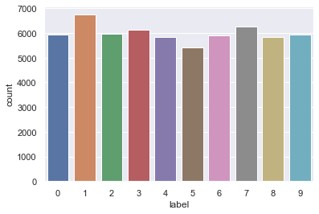
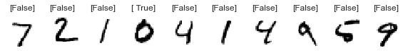

```python
## import the library needed 
import numpy as np 
import pandas as pd 
import matplotlib   
import matplotlib.pyplot as plt
import seaborn as sns
import os
from sklearn.linear_model import LogisticRegression
import idx2numpy
from sklearn.metrics import confusion_matrix
from sklearn.metrics import classification_report
```


```python
# this class hold all functions you neeed in your model 
class pre_model () :
    data = {}
    predictions = {}
    def __init__ (self,number): 
        self.number_need = number
    

    # to read ubyte files an convert it to data frame
    def read_data (self) :
        x_train = idx2numpy.convert_from_file("data/train-images.idx3-ubyte")
        y_train = pd.DataFrame(idx2numpy.convert_from_file("data/train-labels.idx1-ubyte"),columns = ["label"])
        x_test  = idx2numpy.convert_from_file("data/t10k-images.idx3-ubyte")
        y_test  = pd.DataFrame(idx2numpy.convert_from_file("data/t10k-labels.idx1-ubyte"),columns = ["labels"])    
        x_train = pd.DataFrame(x_train.reshape(x_train.shape[0],x_train.shape[1]*x_train.shape[2]))
        x_test = pd.DataFrame(x_test.reshape(x_test.shape[0],x_test.shape[1]*x_test.shape[2]))
        self.data = {
            "x_train" : x_train,
            "y_train"  : y_train,
            "x_test" : x_test,
            "y_test" : y_test
        }
        return self.data 
    # nromalize data 
    def normalize (self) :
        x_train_norm = self.data["x_train"] / 255.0

        data = {
            "x_train" : x_train_norm,
             "y_train": self.data["y_train"],
             "x_test"  : self.data["x_test"],
             "y_test" : self.data["y_test"]
        }

        return self.data 
    
    # plot summary of data to get intuition about it     
    def plot_summary_of_data (self) :
        sns.set()
        return sns.countplot(x= "label" , data= self.data["y_train"])
    
    # show random examples from the data 
    def show_examples (self) :
        x_train = self.data["x_train"]
        examples = x_train[100:105].to_numpy()
        _, axes = plt.subplots(nrows=1, ncols=5, figsize=(10, 3))
        for ax, image in zip(axes, examples):
            ax.set_axis_off()
            image = image.reshape(28, 28)
            ax.imshow(image, cmap=plt.cm.gray_r, interpolation='nearest')
        return plt.show()
    # convert the multiclassication problem to binary one and choosing the target number 
    def convert_MC_to_BC(self):
        y_train = (self.data["y_train"] == self.number_need )
        y_test = (self.data["y_test"] == self.number_need)
        self.data = {
            'x_train' : self.data["x_train"],
            'y_train' : y_train,
            'x_test'  : self.data['x_test'],
            'y_test' : y_test
        }
        
        return self.data 
    # make predicitons after defining model and train it with the labeled data
    def  make_test_predictions (self):
        model = LogisticRegression(max_iter = 100 )
        model.fit(self.data["x_train"],self.data["y_train"])
        train_predictions = model.predict(self.data["x_train"]).reshape(-1,1)
        test_predictions = model.predict(self.data["x_test"]).reshape(-1,1)
        self.predictions = {
            "train_predictions" : train_predictions,
            "test_predictions" : test_predictions
        }
        print("train accuracy is = ", np.mean(self.data["y_train"] == train_predictions))
        print("test accuracy is = ", np.mean(self.data["y_test"] == test_predictions))
        return self.predictions
    
    # make plot for predictions versus the labeled test data 
    def make_plot_for_testing_data(self):
        x_test = self.data["x_test"].to_numpy()
        predictions = self.predictions["test_predictions"]
        _, axes = plt.subplots(nrows=1, ncols=10, figsize=(10, 3))
        for ax, image , prediction in zip(axes, x_test , predictions):
            ax.set_axis_off()
            image = image.reshape(28, 28)
            ax.imshow(image, cmap=plt.cm.gray_r, interpolation='nearest')
            ax.set_title(f"{prediction}")
        return plt.show()
    
    # report the confusion matrix which indicate FP,FN,TP,TN and f1 score 
    def confusion_matrix (self):
                      
            actual = self.data["y_test"]
            predicted = self.predictions["test_predictions"]
            matrix = confusion_matrix(actual,predicted, labels=[1,0])
            print('Confusion matrix : \n',matrix)
            tp, fn, fp, tn = confusion_matrix(actual,predicted,labels=[1,0]).reshape(-1)
            print('Outcome values : \n', tp, fn, fp, tn)
            matrix = classification_report(actual,predicted,labels=[1,0])
            print('Classification report : \n',matrix)   

            return 
```


```python
pre_model = pre_model(0)
pre_model.read_data()
pre_model.normalize()
pre_model.plot_summary_of_data()
pre_model.show_examples()
data = pre_model.convert_MC_to_BC()
predictions = pre_model.make_test_predictions()
pre_model.make_plot_for_testing_data()
pre_model.confusion_matrix()
```





    
    train accuracy is =     0.993283
    test accuracy is =    0.9922

    





    Confusion matrix : 
     [[ 948   32]
     [  46 8974]]
    Outcome values : 
     948 32 46 8974
    Classification report : 
                   precision    recall  f1-score   support
    
               1       0.95      0.97      0.96       980
               0       1.00      0.99      1.00      9020
    
        accuracy                           0.99     10000
       macro avg       0.98      0.98      0.98     10000
    weighted avg       0.99      0.99      0.99     10000
    

